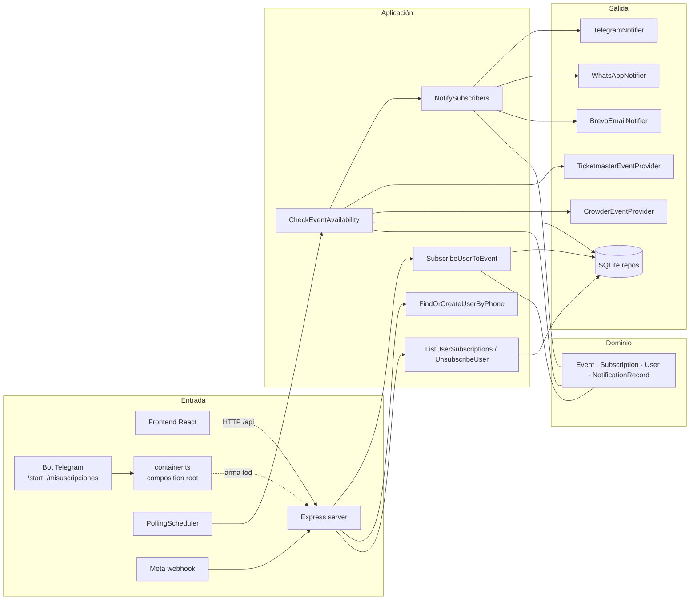
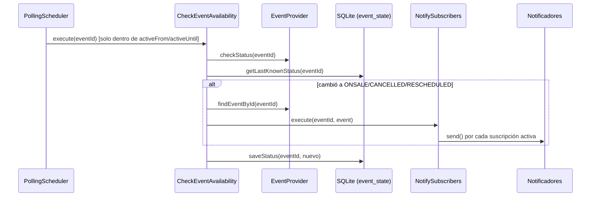

# Anastasia — alertas de disponibilidad de eventos

Vigila eventos de venta de boletas (Ticketmaster y páginas de Ticketmaster.co servidas por Crowder) y avisa a los usuarios suscritos por **Telegram**, **WhatsApp** o **email** apenas cambia su disponibilidad (sale a la venta, se cancela o se reprograma).

- **Backend:** Node.js 22 + TypeScript, Express, SQLite (`better-sqlite3`), arquitectura hexagonal.
- **Frontend:** React 19 + Vite + Tailwind v4, servido por el mismo proceso en producción.
- **Deploy:** Fly.io, app `event-wa`, una sola máquina con volumen persistente.

---

## Índice

1. [Cómo funciona](#cómo-funciona)
2. [Arquitectura](#arquitectura)
3. [Estructura del repositorio](#estructura-del-repositorio)
4. [Modelo de dominio](#modelo-de-dominio)
5. [Flujos principales](#flujos-principales)
6. [API HTTP](#api-http)
7. [Bot de Telegram](#bot-de-telegram)
8. [Configuración](#configuración)
9. [Base de datos y migraciones](#base-de-datos-y-migraciones)
10. [Desarrollo local](#desarrollo-local)
11. [Scripts de soporte](#scripts-de-soporte)
12. [Tests](#tests)
13. [Deploy en Fly.io](#deploy-en-flyio)
14. [Cómo extender el proyecto](#cómo-extender-el-proyecto)
15. [Limitaciones conocidas y pendientes](#limitaciones-conocidas-y-pendientes)

---

## Cómo funciona

1. La lista de eventos vigilados vive en [`config/watched-events.json`](config/watched-events.json).
2. Un **scheduler** consulta periódicamente el estado de cada evento a su proveedor (Ticketmaster Discovery API o scraping de la página de Crowder).
3. El estado se compara con el último conocido, guardado en SQLite. Si cambió a `ONSALE`, `CANCELLED` o `RESCHEDULED`, se notifica a **todas las suscripciones activas** de ese evento, cada una por su canal.
4. Los usuarios se suscriben desde la web identificándose con su **celular**, que es su identidad. Eligen uno o varios canales por evento.

---

## Arquitectura

El backend sigue **arquitectura hexagonal (puertos y adaptadores)**. El dominio y los casos de uso no conocen Express, SQLite ni ningún proveedor externo: dependen de interfaces (*puertos*) que la capa de infraestructura implementa (*adaptadores*).



| Capa | Carpeta | Responsabilidad | Puede depender de |
|---|---|---|---|
| Dominio | `src/domain` | Entidades, value objects y errores. Sin I/O. | nada |
| Aplicación | `src/application` | Casos de uso y puertos (`in` = lo que ofrece, `out` = lo que necesita) | dominio |
| Infraestructura | `src/infrastructure` | Adaptadores concretos: HTTP, SQLite, proveedores, notificadores, scheduler | aplicación, dominio |
| Configuración | `src/config` | Lee el entorno y **arma el grafo de dependencias** (`container.ts`) | todo |

**Punto de entrada:** [`src/main.ts`](src/main.ts) llama a `buildContainer()`, arranca los schedulers y levanta la API HTTP.

---

## Estructura del repositorio

```text
.
├── config/
│   └── watched-events.json        # Eventos vigilados (Ticketmaster + Crowder)
├── src/
│   ├── main.ts                    # Arranque: schedulers + API HTTP + apagado limpio
│   ├── config/
│   │   ├── env.ts                 # Variables de entorno tipadas (requeridas y opcionales)
│   │   ├── container.ts           # Composition root: instancia y conecta todo
│   │   └── watchedEventsConfig.ts # Lee y valida watched-events.json
│   ├── domain/
│   │   ├── entities/              # Event, Subscription, User, NotificationRecord
│   │   ├── value-objects/         # EventStatus, NotificationChannel, NotificationStatus
│   │   └── errors/                # EventNotFoundError, etc.
│   ├── application/
│   │   ├── ports/in/              # Interfaces de los casos de uso
│   │   ├── ports/out/             # EventProviderPort, NotificationPort, *RepositoryPort
│   │   └── use-cases/             # Lógica de negocio (ver tabla abajo)
│   └── infrastructure/
│       ├── event-providers/
│       │   ├── ticketmaster/      # Cliente Discovery API (rate limit + reintentos) y adapter
│       │   └── crowder/           # Scraper HTML (cheerio) con caché y adapter por página
│       ├── notifiers/
│       │   ├── telegram/          # node-telegram-bot-api
│       │   ├── whatsapp/          # Meta Cloud API (mensajes de plantilla)
│       │   ├── brevo/             # Email transaccional
│       │   ├── twilio/            # Stub del canal CALL (no implementado)
│       │   └── statusLabel.ts     # Texto en español de cada EventStatus
│       ├── http/
│       │   ├── server.ts          # Rutas Express + confirmación de Telegram
│       │   ├── phone.ts           # Normalización de celulares y lista de permitidos
│       │   └── whatsappWebhook.ts # Webhook de Meta (verificación + firma HMAC)
│       ├── persistence/
│       │   ├── sqlite/            # Database, repositorios, migraciones versionadas
│       │   └── migrations/        # .sql de documentación (espejo de migrations.ts)
│       ├── scheduler/
│       │   └── PollingScheduler.ts # setInterval con ventanas activas por evento
│       └── telegram/
│           └── PendingTelegramLinkStore.ts # Tokens en memoria para el deep link del bot
├── frontend/                      # SPA React (ver sección Frontend)
├── scripts/                       # Herramientas manuales (ver Scripts de soporte)
├── test/                          # Vitest: domain / application / infrastructure
├── Dockerfile                     # Build multi-stage (frontend + backend + runtime)
├── fly.toml                       # Configuración de Fly.io
└── PLAN-MVP-alertas-eventos.md    # Plan original del MVP
```

### Casos de uso (`src/application/use-cases`)

| Caso de uso | Qué hace |
|---|---|
| `CheckEventAvailability` | Consulta el estado actual al proveedor, lo compara con el guardado, notifica si el cambio es relevante y persiste el nuevo estado. |
| `NotifySubscribers` | Envía a cada suscripción activa del evento por su canal. Devuelve un `NotificationRecord` por intento y registra en el log el motivo de cada fallo. |
| `SubscribeUserToEvent` | Valida que el evento exista en el proveedor y crea la suscripción. Es idempotente: reactiva en vez de duplicar. |
| `FindOrCreateUserByPhone` | Resuelve la identidad del usuario por celular. |
| `ListUserSubscriptions` | Lista las suscripciones activas de un usuario. |
| `UnsubscribeUser` | Desactiva una suscripción, verificando que pertenezca al usuario. |

### Frontend (`frontend/src`)

| Archivo | Rol |
|---|---|
| `main.tsx` / `App.tsx` | Pantalla principal: lista de eventos, filtro *Todos / Mis inscritos / Sin inscribir*, acceso a "Mis suscripciones". |
| `SubscribeModal.tsx` | Alta: pide el celular (validado contra `/api/session`) y permite elegir varios canales. |
| `ManageSubscriptions.tsx` | "Suscrito a": matriz evento × canal con toggles para activar o cancelar. |
| `PhoneSession.tsx` | Contexto React con el celular de sesión (en `localStorage`) y el email de cuenta (traído del servidor). |
| `useEnabledChannels.ts` | Pide `/api/channels` para mostrar solo los canales habilitados en el servidor. |
| `api.ts` | Cliente HTTP tipado de la API. |

En desarrollo Vite corre en `:5173` con proxy de `/api` a `localhost:3001`. En producción el build (`frontend/dist`) lo sirve Express desde `STATIC_DIR`.

---

## Modelo de dominio

| Entidad | Campos clave | Notas |
|---|---|---|
| `User` | `id`, `phone`, `telegramChatId`, `email` | El **celular** es la identidad raíz. Telegram y el email se vinculan a la cuenta. Hay un solo email por usuario. |
| `Subscription` | `userId`, `eventId`, `channel`, `channelTarget`, `active` | `channelTarget` es el chat de Telegram, el celular o el email, según el canal. |
| `Event` | `id`, `name`, `venue`, `status` | Lo construyen los proveedores; no se persiste completo. |
| `NotificationRecord` | `subscriptionId`, `channel`, `status`, `costCents` | Se crea por cada envío, pero **todavía no se persiste**. |

**Estados (`EventStatus`):** `ONSALE`, `OFFSALE`, `CANCELLED`, `RESCHEDULED`. Solo los cambios hacia `ONSALE`, `CANCELLED` o `RESCHEDULED` disparan notificaciones. Al usuario se le muestran en español (`statusLabel.ts`).

**Canales (`NotificationChannel`):** `TELEGRAM`, `WHATSAPP`, `EMAIL` y `CALL` (reservado, sin implementar).

**Formato de ids de evento:**

| Proveedor | Formato | Ejemplo |
|---|---|---|
| Ticketmaster | id de la Discovery API | `ZFIMVHtnMZ17kfjN` |
| Crowder | `crowder:<slug-de-página>/<clave-del-ítem>` | `crowder:bts-world-tour-2026/venta-general-02-10` |

El slug de página evita que ítems con el mismo título ("Venta General 02/10") de eventos distintos compartan suscripciones y estado.

---

## Flujos principales

### Detección y notificación



- La primera lectura de un evento solo fija la línea base y no notifica.
- Cada proveedor de Crowder tiene su propio scheduler e intervalo (60 s por defecto). Ticketmaster usa 15 s.
- **Ventanas activas:** fuera de `activeFrom`/`activeUntil` el scheduler ni siquiera consulta al proveedor. Esto importa para Crowder, que tiene protección anti-bot.
- Un canal sin notificador configurado (faltan credenciales) no rompe nada: esa notificación queda como `FAILED` y se registra en el log.

### Suscripción desde la web

1. El usuario ingresa su celular. `POST /api/session` lo normaliza (`+57 300 123 4567` → `3001234567`) y verifica la lista de permitidos.
2. Elige los canales, de entre los que devuelve `GET /api/channels`.
3. **WhatsApp y email** se activan al instante. El destino de WhatsApp es el mismo celular, y el notificador le antepone el código de país al enviar.
4. **Telegram:** si el usuario ya vinculó su chat antes, la activación es instantánea. Si no, el servidor devuelve un *deep link* `t.me/<bot>?start=<token>`. El token vive 15 minutos en memoria (`PendingTelegramLinkStore`), y cuando el usuario toca **Start** el bot confirma la suscripción (`confirmTelegramSubscription` en `server.ts`).

---

## API HTTP

Todas las rutas que reciben `phone` lo normalizan y aplican `ALLOWED_PHONES`. Un número no permitido recibe `403 {"error":"phone_not_allowed"}`.

| Método | Ruta | Body / Query | Respuesta |
|---|---|---|---|
| `GET` | `/api/events` | — | Lista de `watched-events.json` (`id`, `name`, `venue`). **No consulta a los proveedores.** |
| `GET` | `/api/channels` | — | Canales habilitados, por ejemplo `["TELEGRAM","EMAIL"]`. |
| `POST` | `/api/session` | `{ phone }` | `{ phone }` normalizado, o `403`. |
| `POST` | `/api/subscriptions/telegram` | `{ eventId, phone }` | `{ linked: true, subscriptionId }` o `{ linked: false, token, deepLink }` |
| `POST` | `/api/subscriptions/whatsapp` | `{ eventId, phone }` | `{ subscriptionId }`, o `503 channel_disabled` si el canal está deshabilitado. |
| `POST` | `/api/subscriptions/email` | `{ eventId, phone, email }` | `{ subscriptionId, email }`. Si cambia el email, se actualiza en todas las suscripciones EMAIL del usuario. |
| `GET` | `/api/subscriptions?phone=` | — | Matriz agrupada por evento: `{ id, name, venue, channels: { CANAL: subscriptionId } }[]` |
| `DELETE` | `/api/subscriptions/:id?phone=` | — | `204`, o `404`/`403` si no existe o no es del usuario. |
| `GET` | `/api/users/me?phone=` | — | `{ email }` de la cuenta. |
| `GET` | `/api/webhooks/whatsapp` | `hub.mode`, `hub.verify_token`, `hub.challenge` | Handshake de verificación de Meta. |
| `POST` | `/api/webhooks/whatsapp` | payload de Meta + `X-Hub-Signature-256` | `200`, o `401` si la firma no es válida. Registra estados de entrega y mensajes entrantes en el log. |

> **Seguridad:** no hay verificación real de identidad. Quien conozca un celular permitido puede ver y gestionar sus suscripciones. `ALLOWED_PHONES` es la medida vigente mientras la app se prueba con números conocidos.

---

## Bot de Telegram

Bot: `@<TELEGRAM_BOT_USERNAME>`, con `polling: true`.

| Comando | Acción |
|---|---|
| `/start` | Mensaje de bienvenida. |
| `/start <token>` | Confirma una suscripción iniciada desde la web y vincula el chat al usuario. |
| `/misuscripciones` | Lista las suscripciones **de Telegram** del chat, con un botón para cancelar cada una. |
| `/unsuscribe` | Cancela **todas** las suscripciones de Telegram del chat y desvincula el chat del usuario (para volver a suscribirse hay que pasar otra vez por `/start <token>` desde la web). |

> ⚠️ Telegram permite **un solo consumidor** de `getUpdates` por token. Si el backend local y producción corren a la vez, aparecen errores `409 Conflict` y se pierden confirmaciones. Ver [Desarrollo local](#desarrollo-local).

---

## Configuración

### Variables de entorno

Copia [`.env.example`](.env.example) a `.env`. En Fly.io, las variables no secretas están en `fly.toml [env]` y los secretos se cargan con `fly secrets`.

| Variable | Req. | Default | Descripción |
|---|:---:|---|---|
| `TICKETMASTER_API_KEY` | ✅ | — | API key de la Discovery API. |
| `TELEGRAM_BOT_TOKEN` | ✅ | — | Token del bot. |
| `TELEGRAM_BOT_USERNAME` | ✅ | — | Username del bot sin `@`, para el deep link. |
| `DATABASE_PATH` | | `./data/event-watcher.sqlite` | Ruta del SQLite (en Fly: `/data/...`, en el volumen). |
| `API_PORT` | | `3001` | Puerto HTTP. |
| `FRONTEND_ORIGIN` | | `http://localhost:5173` | Origen permitido por CORS. |
| `STATIC_DIR` | | — | Carpeta del build del frontend (solo en producción). |
| `ALLOWED_PHONES` | | vacío | Celulares habilitados, separados por coma. Vacío = cualquiera. |
| `WATCHED_EVENTS_FILE` | | `./config/watched-events.json` | Archivo de eventos vigilados. |
| `POLLING_INTERVAL_SECONDS` | | `15` | Intervalo del scheduler de Ticketmaster. |
| `TICKETMASTER_MAX_REQUESTS_PER_SECOND` | | `5` | Límite de requests por segundo. |
| `TICKETMASTER_REQUEST_TIMEOUT_MS` | | `8000` | Timeout por request. |
| `TICKETMASTER_RETRY_MAX_ATTEMPTS` | | `3` | Reintentos con backoff exponencial. |
| `TICKETMASTER_RETRY_BASE_DELAY_MS` | | `500` | Base del backoff. |
| `CROWDER_POLLING_INTERVAL_SECONDS` | | `60` | Intervalo de los schedulers de Crowder. |
| `CROWDER_PAGE_CACHE_TTL_SECONDS` | | `60` | Caché del HTML parseado por página. |
| `WHATSAPP_PHONE_NUMBER_ID` | ⚪ | — | Id del número emisor en Meta. |
| `WHATSAPP_ACCESS_TOKEN` | ⚪ | — | Token **permanente** de Usuario del sistema. |
| `WHATSAPP_TEMPLATE_NAME` | ⚪ | — | Plantilla aprobada (es, 3 variables: evento, recinto, estado). |
| `WHATSAPP_API_VERSION` | | `v20.0` | Versión de la Graph API. |
| `WHATSAPP_DEFAULT_COUNTRY_CODE` | | `57` | Se antepone a celulares locales de 10 dígitos. |
| `WHATSAPP_WEBHOOK_VERIFY_TOKEN` | ⚪ | — | String propio para el handshake del webhook. |
| `WHATSAPP_APP_SECRET` | ⚪ | — | App Secret de Meta, para validar la firma del webhook. |
| `BREVO_API_KEY` | ⚪ | — | API key de Brevo (`xkeysib-…`). |
| `BREVO_SENDER_EMAIL` | ⚪ | — | Remitente verificado en Brevo. |
| `BREVO_SENDER_NAME` | | `Event Watcher` | Nombre del remitente. |
| `TWILIO_*` | | — | Reservadas para el canal CALL (sin implementar). |

⚪ = **opt-in**. Si falta alguna variable del grupo, el canal o el webhook correspondiente queda deshabilitado sin romper el arranque:
- **WhatsApp** necesita `PHONE_NUMBER_ID`, `ACCESS_TOKEN` y `TEMPLATE_NAME`.
- **Email** necesita `BREVO_API_KEY` y `BREVO_SENDER_EMAIL`.
- **Webhook** necesita `VERIFY_TOKEN` y `APP_SECRET`.

Los canales deshabilitados no aparecen en `/api/channels` ni en la web.

### `config/watched-events.json`

```json
{
  "ticketmaster": [
    { "id": "ZFIMVHtnMZ17kfjN", "name": "Nombre visible", "venue": "Ciudad",
      "activeFrom": "2026-10-01T00:00:00-05:00", "activeUntil": "2026-10-03T23:59:00-05:00" }
  ],
  "crowder": [
    { "id": "venta-general-02-10",
      "pageUrl": "https://www.ticketmaster.co/event/bts-world-tour-2026",
      "name": "BTS World Tour 2026 — Venta General (02/10)", "venue": "Bogotá",
      "activeFrom": "2026-10-01T00:00:00-05:00", "activeUntil": "2026-10-03T23:59:00-05:00" }
  ]
}
```

- `name` y `venue` son los textos que ven los usuarios, tanto en la web como en las notificaciones.
- En Crowder, `id` es la **clave del ítem dentro de la página**. El id global (`crowder:<página>/<id>`) lo arma `container.ts`.
- `activeFrom` y `activeUntil` son opcionales. Sin ellos, el evento se vigila siempre.
- El archivo se valida al arrancar: campos obligatorios e ids repetidos dentro de una misma página. Si hay un error, la app no arranca.

---

## Base de datos y migraciones

SQLite con tres tablas principales: `users`, `subscriptions` y `event_state` (último estado conocido por evento). Las migraciones están en [`migrations.ts`](src/infrastructure/persistence/sqlite/migrations.ts):
- Se registran en `schema_migrations`.
- Cada una corre **una sola vez, en orden y dentro de una transacción**.
- Los `.sql` de `persistence/migrations/` son solo documentación legible.

| Versión | Cambio |
|---|---|
| 1 | Esquema inicial: `event_state`, `subscriptions` |
| 2 | Tabla `users` + backfill de `subscriptions.user_id` |
| 3 | `users.phone` (único) como identidad raíz |
| 4 | `users.email` como dato de cuenta + backfill |
| 5 | Ids de Crowder con slug de página (`crowder:<clave>` → `crowder:bts-world-tour-2026/<clave>`) |

Para agregar una migración: añade un objeto `{ version: N+1, description, run }` al final de `MIGRATIONS` y su `.sql` de documentación. **Nunca** edites una migración ya desplegada.

---

## Desarrollo local

Requisitos: **Node 22**.

```bash
npm install
npm --prefix frontend install
cp .env.example .env   # y completar

npm run dev                     # backend (tsx watch) en :3001
npm --prefix frontend run dev   # frontend (Vite) en :5173
```

> ⚠️ **Antes de `npm run dev`, apaga producción** para no competir por el bot de Telegram:
> ```bash
> fly machine stop d8944eef3e2308 -a event-wa
> # ...al terminar, cierra el backend local y enciende producción de nuevo:
> fly machine start d8944eef3e2308 -a event-wa
> ```
> Los scripts de `scripts/` **no** necesitan esto: arman el container con `telegramPolling: false`.

| Comando | Acción |
|---|---|
| `npm run dev` | Backend con recarga automática. |
| `npm run build` | Compila el backend a `dist/`. |
| `npm run build:all` | Backend + frontend. |
| `npm start` | Corre `dist/main.js`. |
| `npm test` | Tests (Vitest). |
| `npx tsc --noEmit` | Type-check del backend. |
| `npm --prefix frontend run build` | Type-check y build del frontend. |

---

## Scripts de soporte

Todos se ejecutan con `npx tsx scripts/<nombre>.ts` y usan el `.env` y la base local.

| Script | Uso | Para qué |
|---|---|---|
| `simulate-notification.ts` | `[eventId] [ONSALE\|CANCELLED\|RESCHEDULED]` | **Prueba de punta a punta:** simula un cambio de estado y envía notificaciones **reales** a los suscriptores locales, sin consultar a los proveedores. Sin argumentos, lista los eventos y sus suscripciones. Al terminar restaura el estado. |
| `list-crowder-items.ts` | `<url-de-la-página>` | Hace una sola consulta a una página de Crowder, lista sus ítems con su estado y devuelve el bloque JSON listo para `watched-events.json`. |
| `validate-whatsapp-send.ts` | `<57XXXXXXXXXX>` | Envía la plantilla real de WhatsApp a un número. |
| `validate-brevo-send.ts` | `<email>` | Envía un email real vía Brevo. |
| `seed-subscription.ts` | `<chatId> [eventIds]` | Crea suscripciones de Telegram directamente en la base. |
| `test-crowder-notification.ts` | — | Sirve un HTML de prueba (`fixtures/`) como página de Crowder y ejecuta el flujo real. |
| `validate-crowder-scrape.ts` / `validate-crowder-provider.ts` | — | Diagnóstico del scraping de la página de BTS. |

---

## Tests

```bash
npm test
```

- `test/domain`: reglas de las entidades.
- `test/application`: casos de uso con puertos simulados.
- `test/infrastructure`: servidor HTTP real sobre SQLite en memoria (`:memory:`), notificadores con `fetch` simulado, webhook (firma HMAC), lista de permitidos, provider de Crowder y repositorios.

Los tests no hacen llamadas de red reales.

---

## Deploy en Fly.io

- **App:** `event-wa`, región `gru` (São Paulo). URL: https://event-wa.fly.dev
- **Imagen:** [`Dockerfile`](Dockerfile) multi-stage sobre `node:22-bookworm-slim`. No usa alpine porque `better-sqlite3` es un módulo nativo. Copia `config/` a la imagen.
- **Persistencia:** volumen `event_watcher_data` montado en `/data`.
- **Siempre encendida:** `auto_stop_machines = false` y `min_machines_running = 1`, porque el scheduler no puede dormirse.

```bash
# Secretos (no van en fly.toml)
fly secrets set TICKETMASTER_API_KEY=... TELEGRAM_BOT_TOKEN=... TELEGRAM_BOT_USERNAME=... -a event-wa
# Importar un grupo desde .env (PowerShell):
Get-Content .env | Select-String '^(BREVO|WHATSAPP)_' | ForEach-Object { $_.Line } | fly secrets import -a event-wa

fly deploy -a event-wa
fly status -a event-wa          # si la máquina quedó "stopped": fly machine start <id> -a event-wa
fly logs -a event-wa
```

- Si falta un secreto requerido, `env.ts` lanza un error al arrancar y Fly reinicia la máquina hasta rendirse ("max restart count").
- `fly deploy` **no** enciende una máquina que estaba apagada.

### Integraciones externas

| Servicio | Dónde se configura | Notas |
|---|---|---|
| **Meta / WhatsApp** | developers.facebook.com → app *NotificadorEventos* | Los mensajes que inicia el negocio requieren una **plantilla aprobada**. Con el número de prueba, cada destinatario tiene que estar en la lista de autorizados. Webhook: `https://event-wa.fly.dev/api/webhooks/whatsapp`, campo `messages`. |
| **Brevo** | app.brevo.com | El remitente tiene que estar verificado. El bloqueo por IPs autorizadas debe estar **desactivado**, porque la IP de salida de Fly no es fija. |
| **Telegram** | @BotFather | Un solo proceso puede hacer polling a la vez. |

---

## Cómo extender el proyecto

**Nuevo evento de Crowder**
1. `npx tsx scripts/list-crowder-items.ts <url>`
2. Pega los ítems en `crowder` de `watched-events.json` y ajusta `name`, `venue` y las fechas.
3. Reinicia o despliega. Cada página nueva tiene su propio scheduler y su propia caché.

**Nuevo proveedor de eventos**
1. Implementa `EventProviderPort` en `src/infrastructure/event-providers/<proveedor>/`.
2. Usa un prefijo de id propio para no chocar con los demás proveedores.
3. En `container.ts`, crea su `CheckEventAvailability`, `SubscribeUserToEvent` y `PollingScheduler`, y agrega sus entradas a `watchedEvents`.

No hace falta tocar el dominio ni el esquema de la base.

**Nuevo canal de notificación**
1. Agrega el valor a `NotificationChannel`.
2. Implementa `NotificationPort` en `src/infrastructure/notifiers/<canal>/` (usa `statusLabel()` para el texto).
3. Regístralo en `notifiersByChannel` de `container.ts` cuando tenga credenciales.
4. Agrega la ruta de alta en `server.ts` (con `readPhone` e `isChannelEnabled`) y el canal en `/api/channels` y en el frontend (`CHANNEL_OPTIONS`, `CHANNELS`).

---

## Limitaciones conocidas y pendientes

- **WhatsApp deshabilitado en producción** hasta que Meta apruebe la plantilla y haya un token permanente. Para habilitarlo basta con `fly secrets set WHATSAPP_ACCESS_TOKEN=... WHATSAPP_TEMPLATE_NAME=...`; no requiere cambios de código.
- **`NotificationRecord` no se persiste**, así que no hay historial de envíos. Es necesario antes de implementar cobro por notificación.
- **Sin verificación de identidad** por celular: ver `ALLOWED_PHONES`.
- **Canal CALL (Twilio):** es un stub y siempre devuelve `FAILED`.
- **Crowder** depende del HTML de la plantilla de Ticketmaster.co (`.button_item`, `.tm-status-dot`). Si cambia, hay que ajustar `CrowderPageClient`.
- El webhook de WhatsApp solo escribe en el log; no guarda estados de entrega.
- `node-telegram-bot-api` arrastra dependencias con vulnerabilidades conocidas (`request`).
